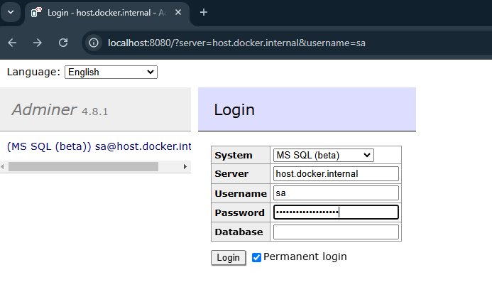
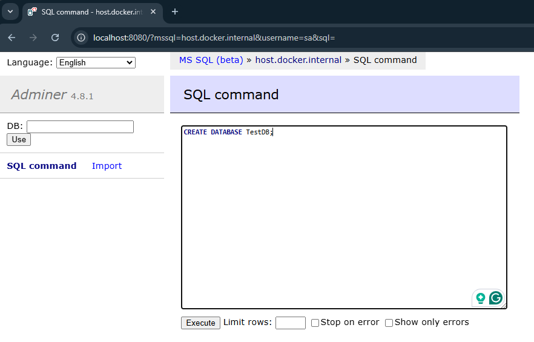
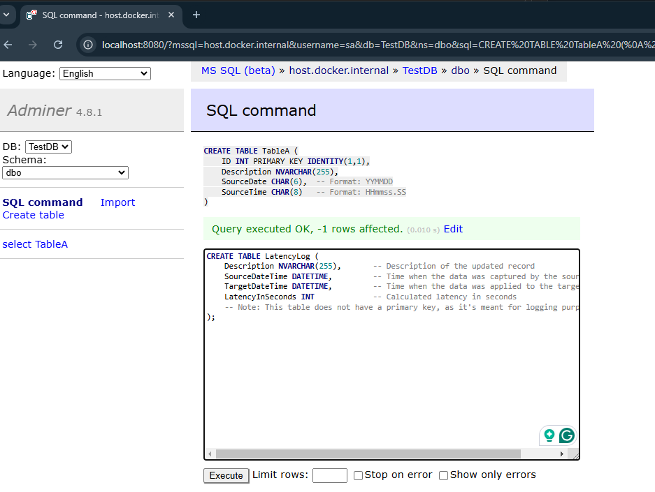
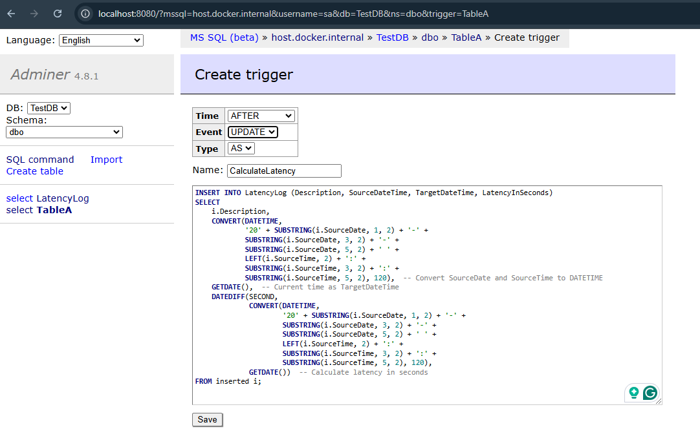
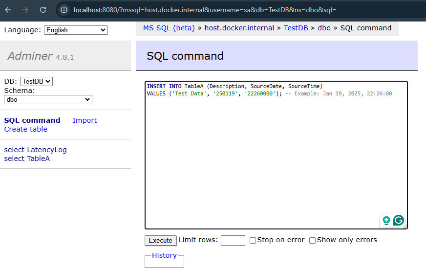
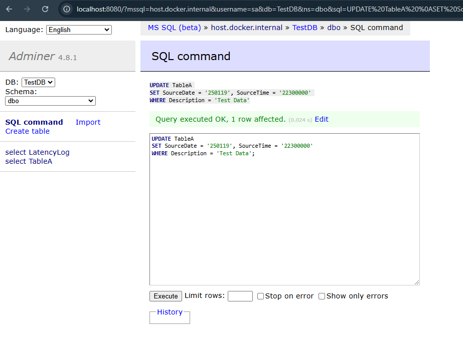
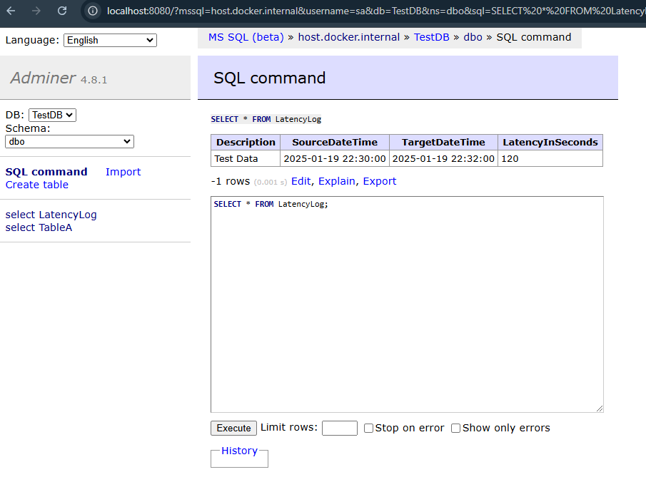

# Q2 Testing Details

This document outlines the step-by-step process for testing the trigger logic implemented in Q2, the outcomes of the test, and supporting screenshots.

## Objective

To validate that the trigger correctly calculates and logs the latency between the source system's recorded time and the actual time the update is applied to the target table.

---

## Testing Steps

1. Ensure the Docker environment is running:
    ```bash
    docker-compose -f docker-compose.yml up

2. Access the database using **Adminer** at [http://localhost:8080](http://localhost:8080).
   - Log in with:
     - **System**: MSSQL
     - **Server**: host.docker.internal
     - **Username**: sa
     - **Password**: YourStrong!Passw0rd



3. Create database
```sql
CREATE DATABASE TestDB;
```



4. Create both tableA and LatencyLog
```sql
--  Create TableA
CREATE TABLE TableA (
    ID INT PRIMARY KEY IDENTITY(1,1),
    Description NVARCHAR(255),
    SourceDate CHAR(6),    -- Format: YYMMDD
    SourceTime CHAR(8)     -- Format: HHmmss.SS
);

-- Create LatencyLog
CREATE TABLE LatencyLog (
    Description NVARCHAR(255),       
    SourceDateTime DATETIME,        
    TargetDateTime DATETIME,         
    LatencyInSeconds INT
);
```



5. Create trigger on TableA via Adminer UI
```sql
INSERT INTO LatencyLog (Description, SourceDateTime, TargetDateTime, LatencyInSeconds)
SELECT 
    i.Description,
    CONVERT(DATETIME, 
            '20' + SUBSTRING(i.SourceDate, 1, 2) + '-' + 
            SUBSTRING(i.SourceDate, 3, 2) + '-' + 
            SUBSTRING(i.SourceDate, 5, 2) + ' ' + 
            LEFT(i.SourceTime, 2) + ':' + 
            SUBSTRING(i.SourceTime, 3, 2) + ':' + 
            SUBSTRING(i.SourceTime, 5, 2), 120),  -- Convert SourceDate and SourceTime to DATETIME
    GETDATE(),  -- Current time as TargetDateTime
    DATEDIFF(SECOND, 
             CONVERT(DATETIME, 
                     '20' + SUBSTRING(i.SourceDate, 1, 2) + '-' + 
                     SUBSTRING(i.SourceDate, 3, 2) + '-' + 
                     SUBSTRING(i.SourceDate, 5, 2) + ' ' + 
                     LEFT(i.SourceTime, 2) + ':' + 
                     SUBSTRING(i.SourceTime, 3, 2) + ':' + 
                     SUBSTRING(i.SourceTime, 5, 2), 120), 
             GETDATE())  -- Calculate latency in seconds
FROM inserted i;
```



6. Test Data Insertion
- Insert a new record into `TableA` to simulate the source system sending data:

```sql
INSERT INTO TableA (Description, SourceDate, SourceTime)
VALUES ('Test Data', '250119', '22260000'); -- Example: Jan 19, 2025, 22:26:00
```



7. Simulate an Update
- Simulate an update to the record, as if sent by the source system:

```sql
UPDATE TableA 
SET SourceDate = '250119', SourceTime = '22300000' 
WHERE Description = 'Test Data';
```



8. Verify Trigger Execution
- Check the LatencyLog table to confirm that the trigger logged the latency information:

```sql
SELECT * FROM LatencyLog;
```



As we can see the trigger is functioning as expected, and it's showing 120 seconds in delay.